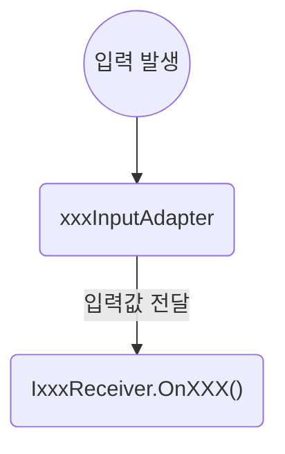
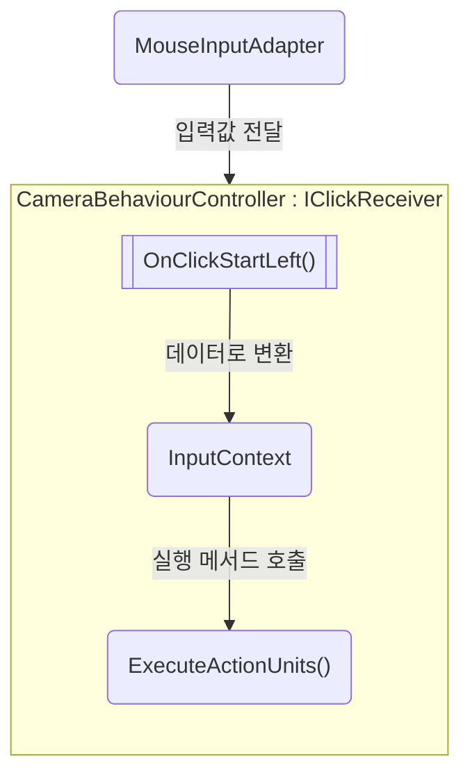
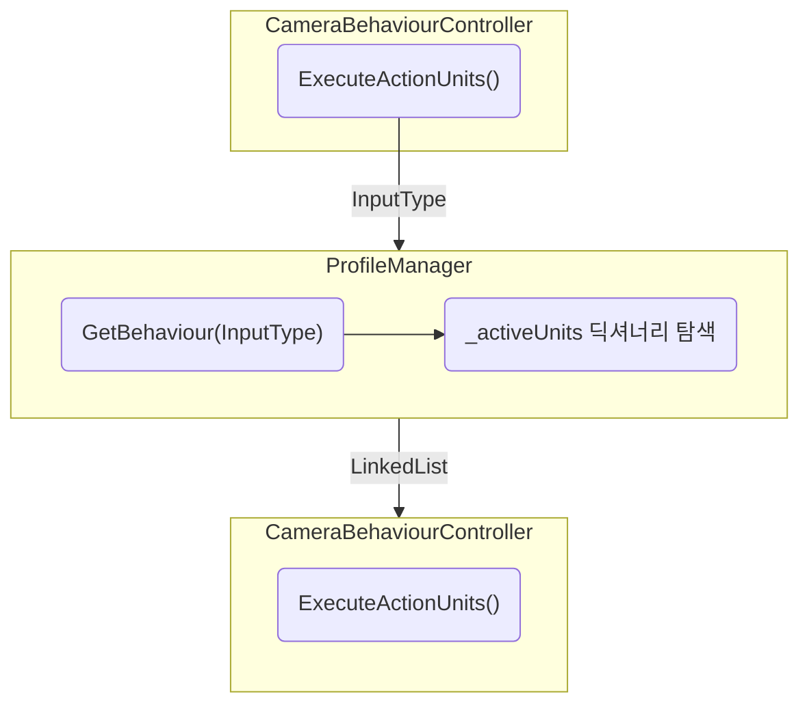
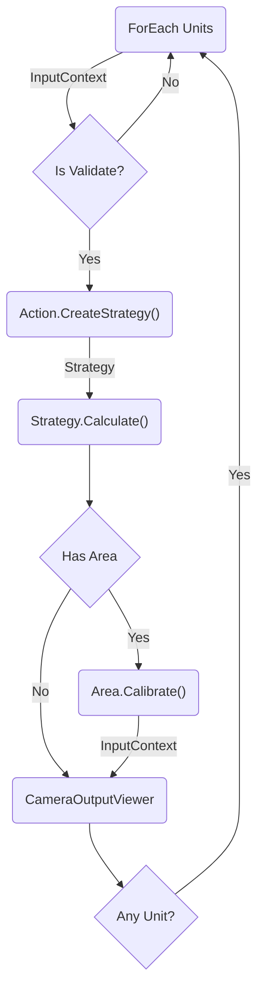
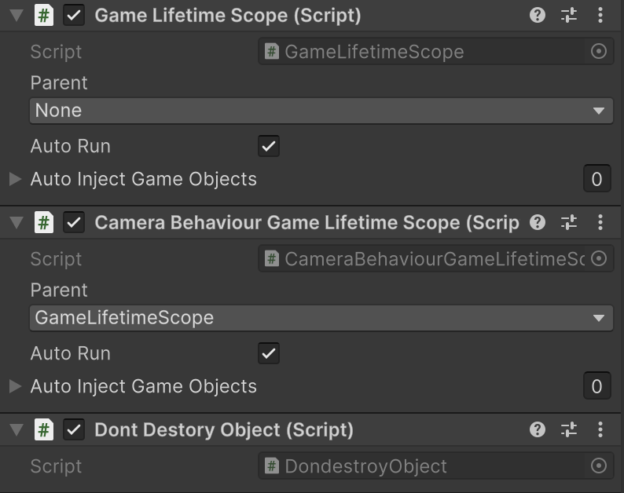
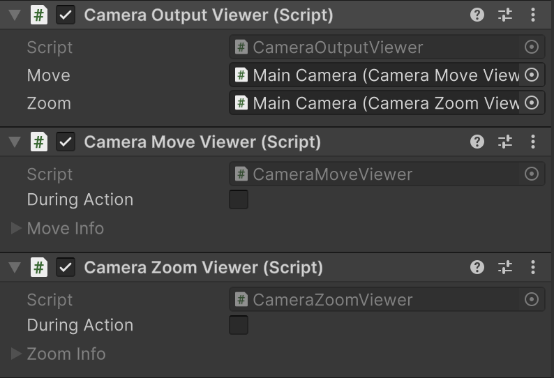
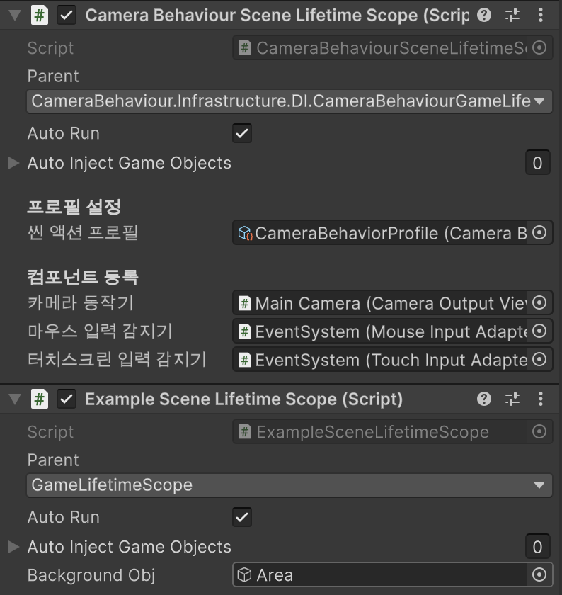
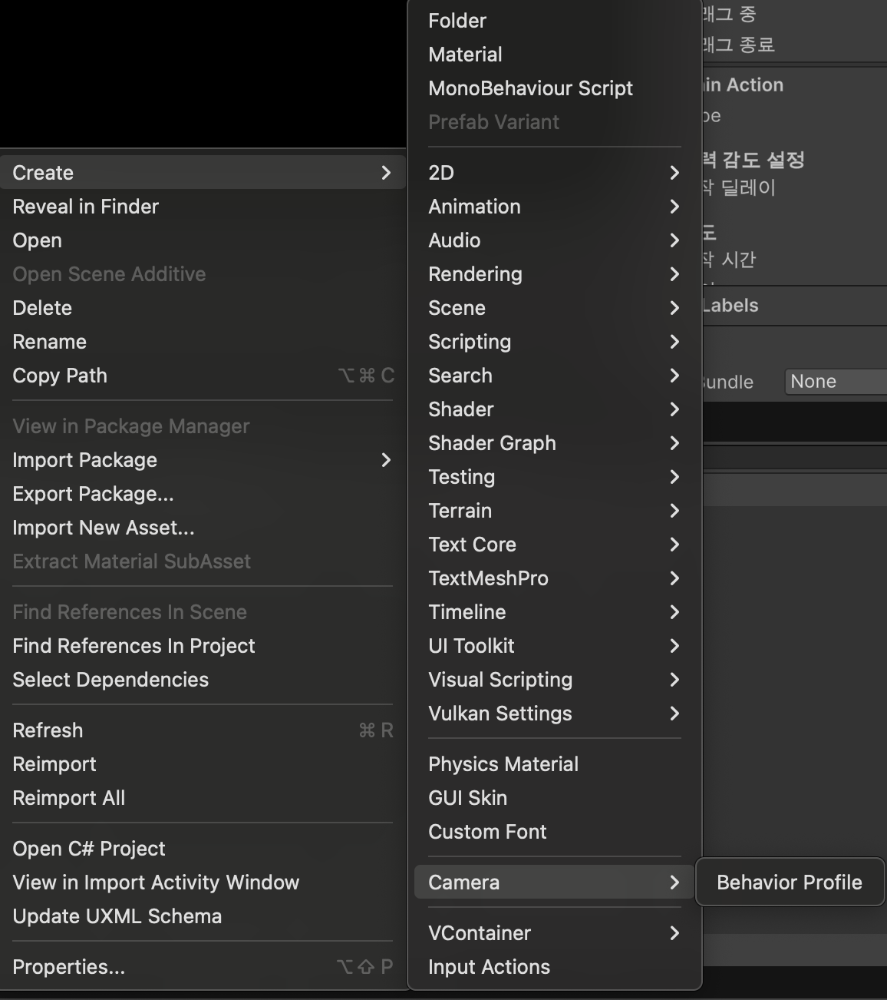
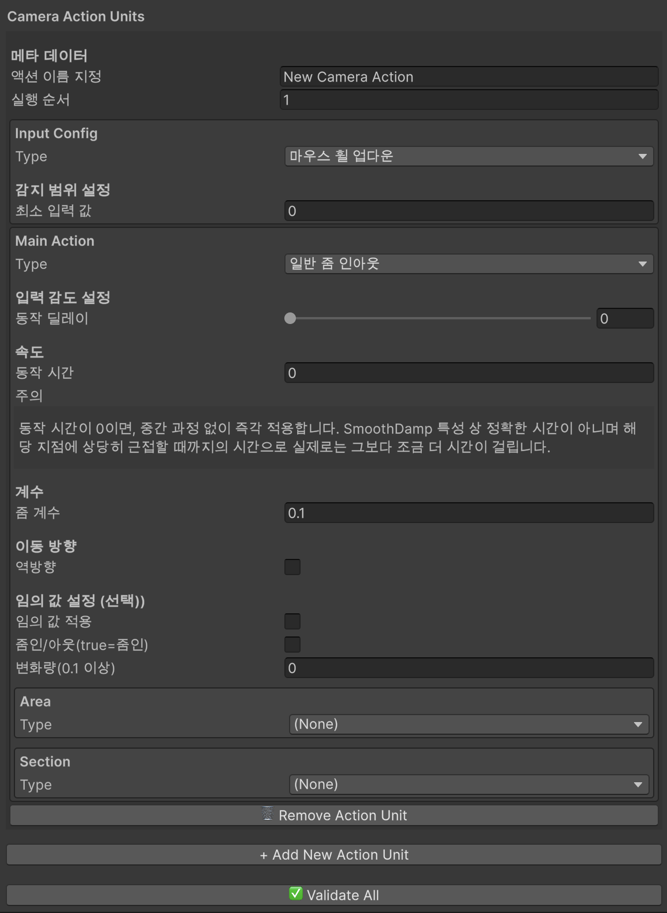

# TouchCamera2DForUnity


입력에 대한 2D 카메라의 동작을 씬마다 정의하고, 차례대로 동작시키는 유니티 커스텀 패키지입니다.
<br><br>참고: 이 프로젝트는 [hadashiA/VContainer]("https://github.com/hadashiA/VContainer?tab=readme-ov-file")를 라이선스 MIT 하에 사용하여 만들었습니다. 해당 패키지를 설치하기 이전에 반드시 [hadashiA/VContainer]("https://github.com/hadashiA/VContainer?tab=readme-ov-file")에서 VContainer 라이브러리를 설치하세요.
<br><br>

## 🗒️ 프로젝트 소개

**📆 프로젝트 기간 : 2025.11.02 ~ 2025.11.13**

2D 카메라의 액션을 입력과 행동, 범위 설정이라는 액션 유닛으로 구성된 프로필을 만들어 각 씬마다 다른 액션을 처리할 수 있게 하자는 목표로 만들게 된 유니티 커스텀 패키지입니다.

프로필은 Scriptable Object화 하여 각 씬마다 별개의 설정을 가질 수 있도록 하였으며, 프로필의 에디터 스크립트를 별도 작성하여 드롭다운으로 쉽게 타입을 선택하고, 그에 맞는 설정 값을 표시하도록 하였습니다.
<br><br>

### 계층 분리

모든 객체는 SRP(단일 책임 원칙: Single Responsibility Principle)을 최대한 따르기 위해 계층으로 구분하여 관리합니다.

- **Data**; 사용자 정의 가능한 동작(입력/행동/범위)을 데이터 형태로 기술
- **Core**: 데이터 계층의 선언을 실제 연산으로 변환하는 실행 엔진. '설정을 어떻게 적용할지'를 담당.
- **Presentation**: 사용자의 입력과 Unity 환경을 연결하는 외부 인터페이스 계층.
- **System**: Core, Data, Presentation 계층을 조합해 실행 순서와 흐름을 제어.
- **Infrastructure**: 인스턴스를 생성, 생명 주기를 관리하고, 필요한 곳에 DI(의존성 주입: Dependency Injection)를 하는 계층.
- **Common**: 공통적으로 사용되는 로직, 데이터.

_(폴더 계층 역시 위의 계층 구조를 따릅니다.)_
<br><br>

### 타입 정의

확장성을 고려하여 모든 **타입**과 타입에 해당하는 **동작**은 베이스 타입을 상속 받아 정의하도록 하였습니다.

- `InputConfigBase`: 입력 타입을 정의하는 베이스 클래스
- `ActionConfigBase`: 동작 타입을 정의하는 베이스 클래스
- `IActionStrategy`: 동작 타입에 대한 연산을 정의하는 인터페이스
- `AreaConfigBase`: 동작의 범위를 정의하는 베이스 클래스

모든 타입은 위의 객체를 상속 받아 정의하면, 자동으로 프로필 에셋의 인스펙터 상에서 표시됩니다.
<br><br>

### 플로우 정리

#### 1. 입력 발생 및 전달

입력이 발생하면, 입력을 Adapter에서 감지하고, 등록한 Receiver에 전달합니다.



<br><br>

#### 2. 입력값을 공통 데이터로 변환

받은 입력값을 공통 데이터인 InputContext로 변환하고, 실행 메서드로 전달합니다.



<br><br>

#### 3. 적용된 프로필에서 해당하는 액션 유닛 리스트를 탐색

`CameraProfileManager.cs`에서 현재 적용된 프로필의 액션 유닛 중에 현재 발생한 입력 타입과 일치하는 유닛의 리스트(링크드 리스트)를 가져옵니다. (순서 보장)



<br><br>

#### 4. 리스트를 순회하며 연산 및 동작

액션 유닛의 입력, 동작, 범위 타입에 맞게 입력값을 검증, 연산합니다.
<br>연산된 결과값을 InputContext 내부에 담아 Config와 함께 `CameraOutputViewer.cs`에 전달하면, Viewer가 카메라 오브젝트를 갖고 동작을 실행합니다.



<br><br>

### DI (의존성 주입: Dependency Injection)

입력/동작/범위 타입의 확장성을 고려해 전략 패턴(Strategy Pattern)을 사용하였습니다. 이에 따라 컴파일 타임에서 지정하기 보다는 동적으로 객체 간 연결이 필요했고, DI를 사용하여 연결하기로 하였습니다.

DI를 조금 더 구조적으로 관리하기 위해 [hadashiA/VContainer]("https://github.com/hadashiA/VContainer/releases/tag/1.17.0") 라이브러리를 사용했습니다. 해당 라이브러리는 컴파일 단계에 Scope별로 타입에 대한 인스턴스를 원하는 객체에 주입시킬 수 있어 다음의 장점이 있습니다.

- **높은 확장성** : 새로운 입력/동작/범위 로직을 생성할 때마다 조건문 등의 추가적인 코드로 주입시킬 필요 없어 유지보수의 범위가 줄어듭니다.
- **전략 패턴과 상호보완성** : 인터페이스를 통해 컨테이너에 등록할 수 있어 씬마다 동적으로 다른 인스턴스를 쉽게 주입 할 수 있습니다.

<br><br>

## 📌 프로그래밍 언어 및 프레임워크


<br><br>
[]("https://github.com/hadashiA/VContainer/releases/tag/1.17.0")
<br>
해당 프로젝트는 의존성 주입을 위해 [hadashiA/VContainer]("https://github.com/hadashiA/VContainer/releases/tag/1.17.0") 라이브러리를 사용하였습니다.
<br><br>

## 💾 패키지 설치 방법

⚠️ 주의 사항: import 하려는 프로젝트에 [hadashiA/VContainer]("https://github.com/hadashiA/VContainer/releases/tag/1.17.0") 라이브러리를 먼저 설치하세요.

### Unity Package Manager

1. 유니티 에디터의 상단 바에서 'Window/Package Managements/Package Manager'를 선택합니다.
2. '+' 버튼을 눌러 'install package from git url...'을 선택합니다.
3. 아래의 url을 붙여넣습니다.

```
https://github.com/MoHoDu/TouchCamera2DForUnity.git
```

4. sample 탭에서 샘플을 import 하면 사용 방법을 더 쉽게 이해할 수 있습니다.

### UnityPackage

1. `.unitypackage` 파일을 [releases]("https://github.com/MoHoDu/TouchCamera2DForUnity/releases") 페이지에서 다운 받습니다.
2. `TouchCamera2DForUnity.x.x.x.unitypackage` 파일을 실행합니다.

<br>

## 🧑🏻‍💻 사용 방법

❗️ 현재 마우스, 터치 입력을 감지하는 `MouseInputAdapter.cs`, `TouchInputAdapter.cs`가 InputManager(old)를 사용 중입니다. 먼저 Player Settings에서 Active Input Handling을 'InputManager(old)'로 설정해주세요.

아래의 내용을 이해하기 어렵다면, Sample을 참고하세요. 테스트를 하시려면, Build Profile의 씬 리스트로 등록한 뒤에 TestScene01을 실행하세요.
<br><br>

### 인게임 최초 진입 씬 - 컴포넌트 배치

1. GameLifetimeScope 컴포넌트 추가
   <br>초기에 진입할 씬에 `GameLifetimeScope.cs`와 `CameraBehaviourGameLifetimeScope.cs`를 한 오브젝트에 컴포넌트로 추가합니다. 해당 오브젝트는 `DontDestroyOnLoad` 등으로 씬 전환 시에 파괴되지 않도록 해주세요.

2. Parent 등록
   <br>`CameraBehaviourGameLifetimeScope.cs` 컴포넌트의 Parent를 `GameLifetimeScope`로 설정합니다.

<br>
<figure>
    
    <figcaption>GameLifetimeScope 컴포넌트 추가 예시</figcaption>
</figure>
<br>

### 카메라 동작을 정의할 씬 - 컴포넌트 배치

새로운 카메라 동작을 정의할 씬으로 이동하여 컴포넌트를 배치합니다. 새롭게 정의할 씬을 생성할 때마다 해당 내용을 적용하시면 됩니다.

1.  카메라 오브젝트에 컴포넌트 추가
    <br>카메라 오브젝트에 `CameraOutputViewer.cs`, `CameraMoveViewer.cs`, `CameraZoomViewer.cs` 컴포넌트를 등록합니다. `CameraOutputViewer.cs` 컴포넌트 내부의 Move, Zoom 필드에 해당하는 컴포넌트를 등록합니다.

2.  입력 감지 컴포넌트 배치
    <br>다른 한 오브젝트에 입력을 감지할 `MouseInputAdapter.cs`와 `TouchInputAdapter.cs` 컴포넌트를 등록합니다.

3.  LifetimeScope 컴포넌트 배치
    <br>`CameraBehaviourSceneLifetimeScope.cs`를 한 오브젝트에 컴포넌트로 추가합니다. 컴포넌트 내부에 필드에 각각 위에서 배치한 알맞은 컴포넌트를 등록합니다.
    <br>`CameraBehaviourSceneLifetimeScope.cs`의 Parent를 `CameraBehaviourGameLifetimeScope`로 설정합니다.

4.  _(선택 사항) ExampleLifetimeScope 컴포넌트 배치_
    _<br>배경 오브젝트를 지정하여 범위를 한정하는 'BackgroundObjectArea' 타입 설정을 위해서 `ExampleSceneLifetimeScope.cs`를 같은 오브젝트에 배치합니다.
    <br>Parent를 `GameLifetimeScope`로 설정합니다.
    <br>배경 오브젝트로 등록할 GameObject를 필드에 등록합니다._

<br>
<figure>
    
    <figcaption>카메라 컴포넌트 추가 예시</figcaption>
</figure>
<br>
<figure>
    
    <figcaption>SceneLifetimeScope 컴포넌트 추가 예시</figcaption>
</figure>
<br>

### 프로필 생성 및 적용

씬에 적용할 새로운 프로필을 생성하고, 씬에 적용합니다.

1. Project 뷰에서 우클릭 `Create/Camera/Behaviour Profile`을 선택해서 프로필을 생성합니다.
2. `Add New Action Unit`을 눌러 새로운 액션을 만들고, 입력/행동에 대한 타입과 세부 설정을 세팅합니다. Area(범위 설정)은 선택 사항입니다.
3. 설정을 모두 마친 뒤에는 Validate All 버튼을 눌러 설정이 제대로 되었는지 로그로 확인합니다.
   <br>\"✅ No issues found in CameraBehaviorProfile.\"라는 내용이 나오면 문제가 없는 것입니다.
4. 세팅이 완료된 프로필은 이전에 씬 내에 배치한 컴포넌트(CameraBehaviourSceneLifetimeScope)의 프로필로 추가합니다.

<br>
<figure>
    
    <figcaption>카메라 프로필 생성 메뉴</figcaption>
</figure>
<br>
<figure>
    
    <figcaption>카메라 프로필 설정 예시</figcaption>
</figure>
<br>

### 실행

초기 진입 씬부터 각 행동이 정의된 씬을 이동하면서 설정한 행동이 잘 적용되는지 확인합니다.
<br><br>

## Author

@MoHoDu
<br><br>

## License

MIT License

자세한 내용은 [LICENSE.md](./LICENSE.md) 파일 참고
